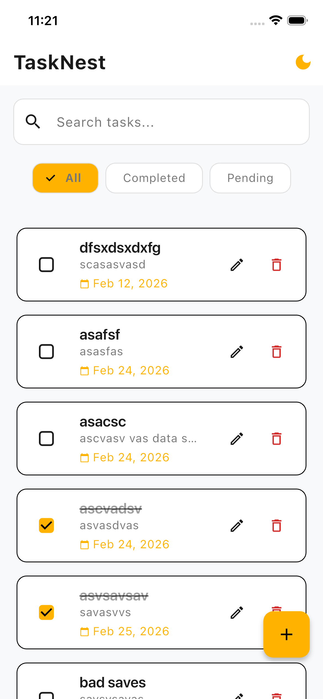
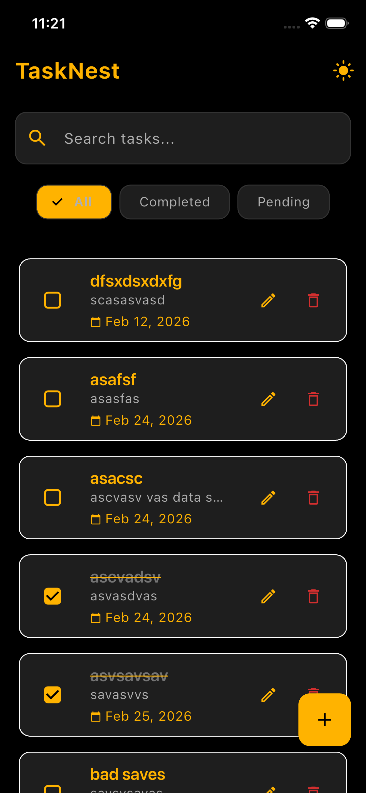

# Task Manager App (TaskNest)


A high-performance, robust, and elegant task management application built as a **Flutter Internship Assessment Task**. This project demonstrates a deep understanding of Clean Architecture, state management using BLoC, and local data persistence with Hive.

## 📱 Screenshots

| Light Mode | Dark Mode |
|:---:|:---:|
|  |  |

---

## ✨ Features

- **Full CRUD Operations**: Create, Read, Update, and Delete tasks seamlessly.
- **Task Management**: Mark tasks as completed or incomplete with a simple toggle.
- **Smart Filtering**: Filter tasks by status (All, Completed, Pending) to stay organized.
- **Live Search**: Quickly find specific tasks using the real-time search functionality.
- **Dynamic Theming**: Instant toggle between professional Light and premium Dark modes.
- **Persistence**: All data is saved locally, ensuring tasks are available offline.
- **Modern UI**: A "SaaS-style" interface with smooth animations and responsive design.

---

## 🏗️ Architecture Explanation

The project follows **Clean Architecture** with a **Feature-First** folder structure. This ensures the codebase is scalable, maintainable, and testable.

### Layers:
1. **Presentation Layer**: 
   - Uses **BLoC (Business Logic Component)** to manage UI states.
   - Decoupled UI components (Widgets & Pages) that react to state changes.
2. **Domain Layer**:
   - The heart of the application containing **Entities** (business models) and **Use Cases**.
   - It is completely independent of other layers and contains the core business logic.
3. **Data Layer**:
   - Consists of **Repositories** (implementations of domain interfaces) and **Data Sources**.
   - Handles data retrieval from **Hive** (local database).

### Key Principles:
- **Separation of Concerns**: Each layer has a specific responsibility, reducing coupling.
- **Dependency Rule**: Dependencies point inwards. The core (Domain) knows nothing about the outer layers (Data/Presentation).
- **OOP Principles**: Applied abstraction, encapsulation, and inheritance to ensure code reusability and clarity.

---

## 📂 Folder Structure

```text
lib/
├── core/
│   ├── error/          # Failure handling
│   ├── theme/          # AppTheme, AppColors, ThemeCubit
│   └── utils/          # Constants and helpers
├── features/
│   └── task/
│       ├── data/
│       │   ├── datasources/   # Hive data interaction
│       │   ├── models/        # Hive-specific models
│       │   └── repositories/  # Repository implementations
│       ├── domain/
│       │   ├── entities/      # Plain Dart entities
│       │   ├── repositories/  # Abstract repository interfaces
│       │   └── usecases/      # CRUD business logic
│       └── presentation/
│           ├── bloc/          # TaskBloc events/states
│           ├── pages/         # Screen layouts
│           └── widgets/       # Reusable UI components
└── main.dart                  # App entry & Dependency Injection
```

---

## 🚀 State Management (BLoC)

**BLoC** was chosen for this project because it provides:
- **Predictable State Transitions**: Every UI change is a result of an event.
- **Scalability**: Easily handles complex business logic as the app grows.
- **Separation**: Keeps the UI logic entirely separate from the business logic, facilitating easier testing.

---

## 💾 Local Database (Hive)

**Hive** is used for local persistence for the following reasons:
- **Performance**: It is significantly faster than SQLite or SharedPreferences.
- **NoSQL**: Perfect for storing simple objects like Tasks without complex relational overhead.
- **Lightweight**: Minimal impact on the final app size.

---

## 🎨 Theme Management

The app implements a custom **ThemeCubit** to manage `ThemeMode`.
- **Light Mode**: Vibrant Yellow accents on professional off-white/grey backgrounds.
- **Dark Mode**: Premium Stealth Black background with high-contrast Yellow accents.
- All styles are centralized in `AppTheme` and `AppTextStyles`, ensuring zero hardcoded colors in UI widgets.

---

## 📦 Packages Used

- **`flutter_bloc`**: Powering the state management and theme switching.
- **`equatable`**: Simplifying object comparisons for optimized UI rebuilding.
- **`hive` / `hive_flutter`**: Efficient NoSQL local storage.
- **`intl`**: Formatting dates and timestamps.
- **`uuid`**: Generating unique IDs for new tasks.
- **`lottie`**: Enhancing the splash screen with smooth animations.

---

## 🛠️ Setup Instructions

1. **Prerequisites**: Ensure you have [Flutter](https://docs.flutter.dev/get-started/install) installed on your machine.
2. **Clone the repository**:
   ```bash
   git clone https://github.com/m-rehan-developer/tasknest.git
   cd tasknest
   ```
3. **Install dependencies**:
   ```bash
   flutter pub get
   ```
4. **Generate Hive Adapters**:
   ```bash
   flutter pub run build_runner build --delete-conflicting-outputs
   ```

---

## 🏃 How to Run

To run the project in debug mode on your connected device/simulator:

```bash
flutter run
```

---

## 🔮 Future Improvements

- [ ] **Push Notifications**: Reminders for upcoming task deadlines.
- [ ] **Cloud Sync**: Optional Firebase integration for cross-device syncing.
- [ ] **Task Categorization**: Custom tags (Work, Personal, Urgent).
- [ ] **Unit & Widget Testing**: Increasing test coverage for the Domain and Presentation layers.

---

## 👤 Author

**Muhammad Rehan**  
*Flutter Developer*  
[LinkedIn](https://www.linkedin.com/in/rehan-malik) | [GitHub](https://github.com/m-rehan-developer)
